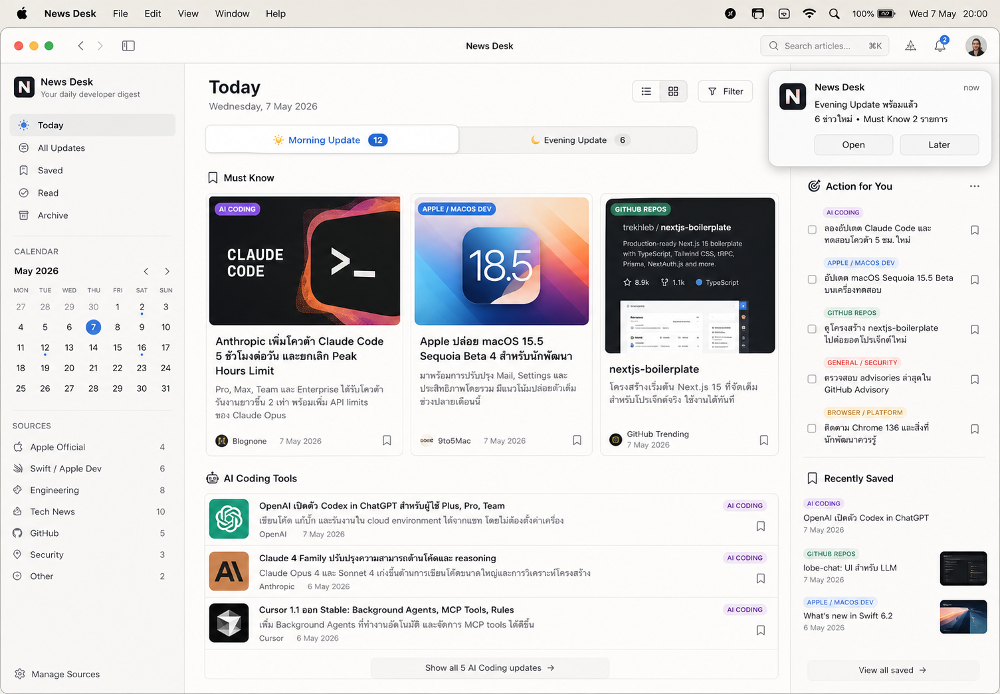

# News Desk

News Desk is a local macOS-first visual dashboard for twice-daily developer news digests.

It is designed around a Notion-style reading experience: Morning/Evening tabs, image-rich cards, colored topic tags, saved/read states, and an Action for You rail.

## Current milestone

- Tauri + React + Vite + TypeScript scaffold
- Visual dashboard matching `docs/news-desk-concept.png`
- Browser preview fallback with demo data
- Tauri command bridge for snapshot loading, OPML import, digest runs, and native notification calls
- OPML import path wired for `/Users/peerapatj/Downloads/Subscriptions-OnMyMac.opml`
- Rule-based article classification utilities for AI Coding, Apple/macOS Dev, GitHub Repos, Security, and Broader IT

## Runtime model

The long-term pipeline is:

```text
NetNewsWire OPML -> local feed fetch -> rules filter -> AI summary -> SQLite -> News Desk UI -> macOS notification
```

Codex Automations are not part of the runtime path. They can remain as a prototype until this app's digest output feels right, then be paused.

## Development

```bash
npm install
npm run dev
```

Native Tauri runs require the Rust toolchain. If `cargo` is unavailable, use the Vite browser preview while developing the UI.

```bash
npm run tauri dev
```

## Visual reference

Accepted concept:



